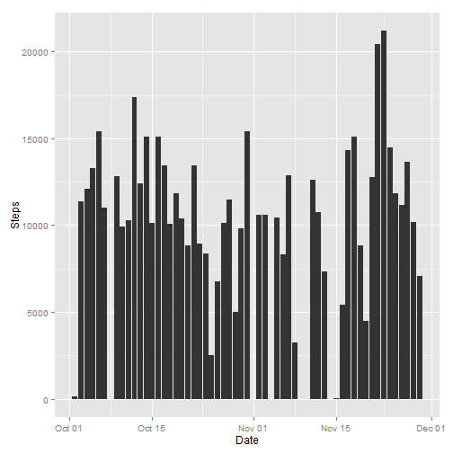
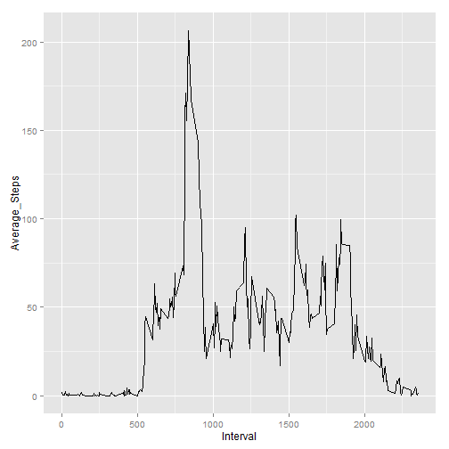
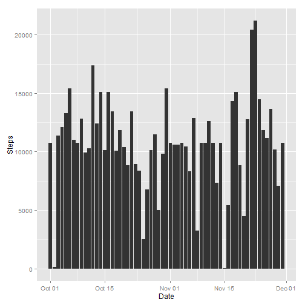
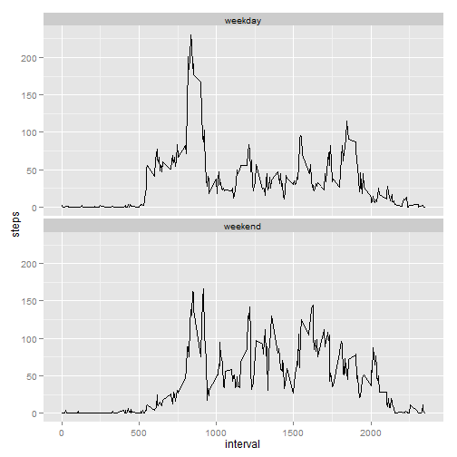

###By yukiCao
##Data preprocessing


```r
    Sys.setlocale("LC_TIME", "English")
    library(data.table)
    library(ggplot2)
    setwd("D:/Data Science/Reproducible Research")
    data <- fread("activity.csv")
    data1<- na.omit(data)
    data1$date <- as.Date(data1$date,format = "%Y-%m-%d")
```

##What is mean total number of steps taken per day?
###1.Plot the histgram of total steps in each day.
####Ignored the NA.


```r
    total_steps <- aggregate(steps~date,data1,sum)
    qplot(total_steps$date,total_steps$steps,geom="histogram",stat="identity")+
        labs(x="Date",y="Steps")
```

 

###2.The mean and median total number of steps taken per day


```r
    summary(total_steps$steps)[4:3]
```

```
##   Mean Median 
##  10770  10760
```
##What is the average daily activity pattern?
###1.The 5-minute interval and the average number of steps taken plot.


```r
    mean_perday <- aggregate(steps~interval,data1,mean)
    qplot(mean_perday$interval,mean_perday$steps,geom="line")+
        labs(x="Interval",y="Average_Steps")
```

 

###2.The '5-minute interval' of containing the maxmimun number of steps.


```r
    mean_perday[which.max(mean_perday$steps),1]
```

```
## [1] 835
```
##Imputing missing values
###1.Calculate and report the total number of missing values in the dataset


```r
    sum(is.na(data))
```

```
## [1] 2304
```

###2.Make a histogram of the total number of steps taken used the filled-in missing values data.


```r
    na_num <- which(is.na(data$steps))
    filled_data <- as.data.frame(data)
    #The strategy of imputing missing values: let the 'NA' equal '5-minute interval' 
    for(i in na_num){
        filled_data[i,1]=mean_perday[mean_perday[,1]==filled_data[i,3],]$steps
    }
    filled_data$date <- as.Date(filled_data$date,format = "%Y-%m-%d")
    total_test<-aggregate(steps~date,filled_data,sum)
    qplot(total_test$date,total_test$steps,geom="histogram",stat="identity")+
        labs(x="Date",y="Steps")
```

 

###3.The mean and median total number of steps taken per day in new dataset.

```r
    summary(total_test$steps)[4:3]
```

```
##   Mean Median 
##  10770  10770
```

##Are there differences in activity patterns between weekdays and weekends?
###1.Create a new factor variable in the dataset with two levels – “weekday” and “weekend”.


```r
    filled_data$day <- ifelse(weekdays(filled_data$date)%in% c("Saturday","Sunday"),"weekend","weekday")
    filled_data$day <- as.factor(filled_data$day)
```
###2.Make a panel plot of '5-minute interval'and the average number of steps taken, averaged across all weekday days or weekend days


```r
    test_mean <- aggregate(steps~interval+day,filled_data,mean)
    g <- ggplot(test_mean,aes(interval,steps))
    g+geom_line()+facet_wrap(~ day,ncol=1)
```

 
